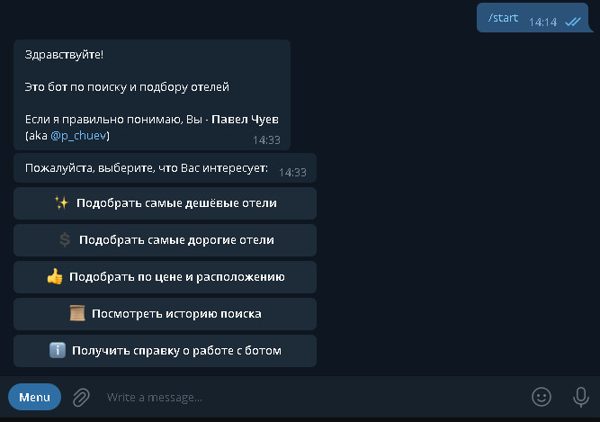
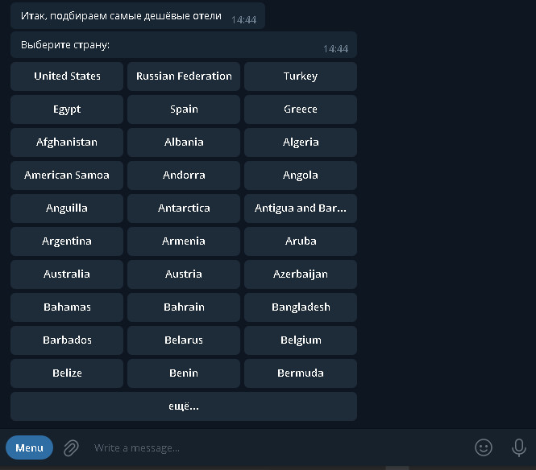
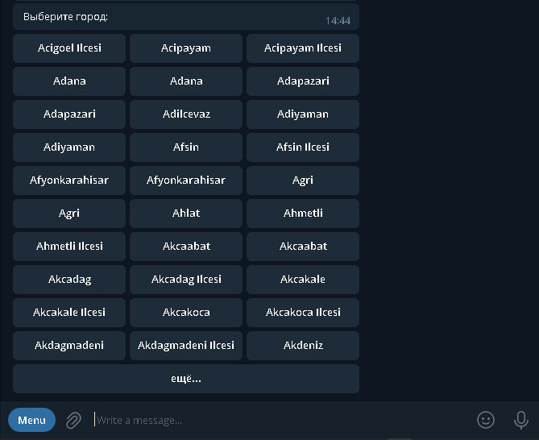
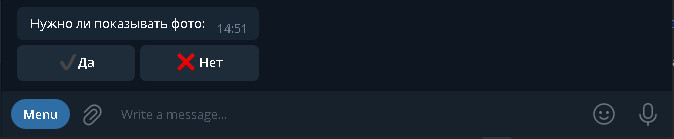
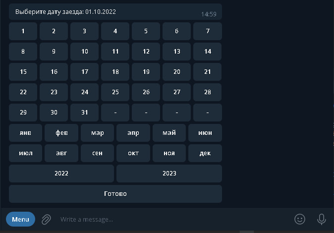
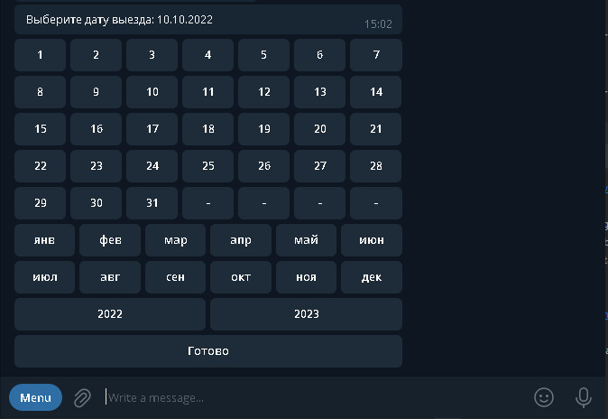
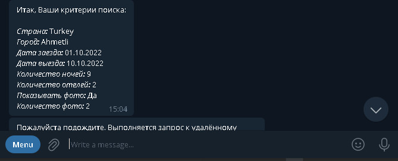
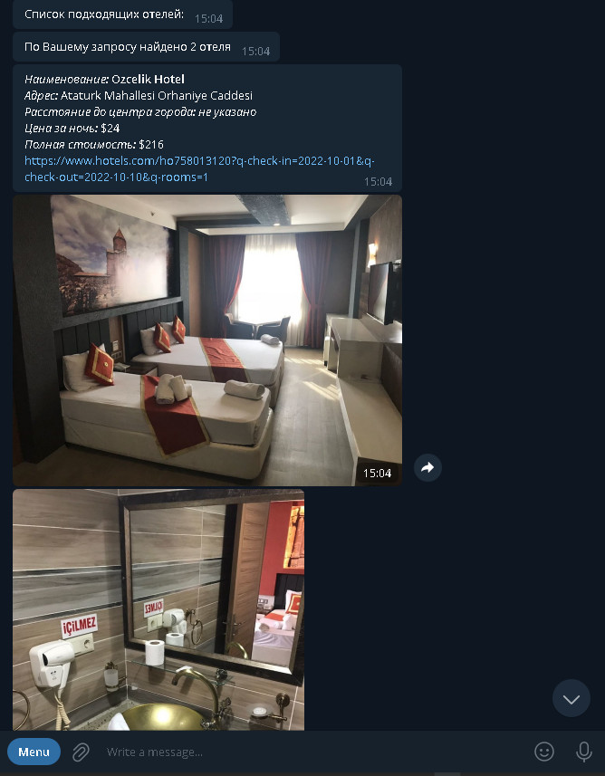

#### Курсовой проект
## Телеграм-бот
#### для анализа сайта Hotels.com и поиска подходящих пользователю отелей

###### Студент: _Павел Чуев_
###### Курс: _"Python-разработчик"_
###### Модуль: _Python Basics_

---
Bot's username:

#### @pc_hotels_bot

---
##### Версии программы:
- локальная версия (на локальном компьюетре)
- репозиторий на Skillbox GitLab  
https://gitlab.skillbox.ru/pavel_chuev/python_basic_diploma/-/tree/basics_2
- репозиторий на GitHub  
https://github.com/p-tm/skillbox-diploma.git
- деплой на PythonAnyWhere
- Image на Docker Hub  
https://hub.docker.com/repository/docker/ppro2012/pc-hotels-bot

---
##### Инструкции по запуску локальной версии:
- установка дополнительных библиотек:  

        pip install pyTelegramBotAPI
- запуск программы бота  

        python main.py
(внутри программы работает бесконечный цикл; останов через "ctrl+c")

---
##### Инструкции по использованию Docker-image
Для использования docker-image на компьютере должна быть установлена программа docker
- скачать изображение  

        docker pull ppro2012/pc-hotels-bot
- запуск программы (программа будет запущена в новом контейнере) 

        docker run ppro2012/pc-hotels-bot
- получить список выполняющихся контейнеров  

        docker ps
(в столбце NAMES посмотреть имя контейнера который запускает изображение ppro2012/pc-hotels-bot)
- остановить приложение

        docker stop <имя контейнера>
(эту команду необходимо выполнить в отдельном терминале)  

После этого контейнер можно удалить, для этого:
- получить список всех контейнеров и получить имя контейнера

        docker ps --all
- удалить контейнер

        docker rm <имя контейнера>
Также можно воспользоваться программой **Docker Desktop**

---

##### Работа с приложением

- Найдите в телеграм бота по имени @pc_hotels_bot
- Запустите бота командой /start
- Выберите в главном меню интересующий Вас пункт  
  
- Выберем, например, "Подобрать самые дешёвые отели". 
Выбор начинается с указания страны (производится при помощи кнопок). Поскольку стран много, вывод производится поэтапно. Если искомая страна отсутствует в списке, нажмите кнопку "ещё..." внизу списка.
  
- Далее производится выбор города  
  
Если искомый город отсутствует в списке, нажмите кнопку "ещё..." внизу списка
- Далее указываем тербуемое количество отелей  
  
*Данные вводятся с виртуальной клавиатуры устройства путём ввода числа*
- Далее указываем, требуется ли фото  
  
- Если мы выбрали, что фото требуется, то далее указываем требуемое количество фото
  
- Далее выбираем дату заезда  
  
*Данные вводятся с виртуальной клавиатуры, специально предназначенной для ввода дат*  
*По окончании ввода даты нажмите кнопку "Готово"*
- Далее выбираем дату выезда  
  
*Данные вводятся с виртуальной клавиатуры, специально предназначенной для ввода дат*  
*По окончании ввода даты нажмите кнопку "Готово"*  
*Дата выезда должна быть указана позднее даты заезда, но не более 28 дней после даты заезда*  
*В случае некорректного ввода бот сообщит об этом и пропросит повторить ввод*
- После этого выводится резюмирующая информацию по выбранным опциям поиска
и сообщает о том, что возможно потребуется некоторое ожидание  
  
- Если поиск прошёл успешно, бот выдаёт результаты поиска  
  
- После вывода результатов поиска вновь выводится "главное меню", пользователь может продолжить поиск  
  
- поскольку ввод опций поиска производится в несколько шагов, если необходимо прерывать процесс, это делается при помощи команды /stop

